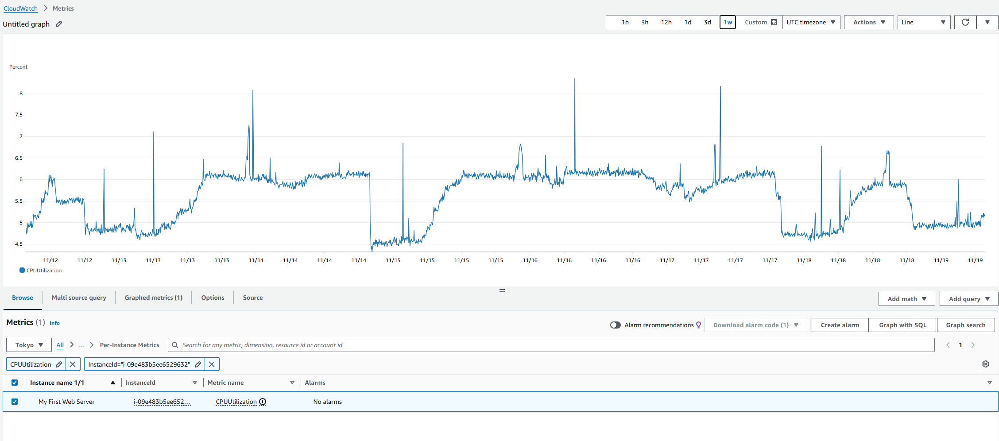
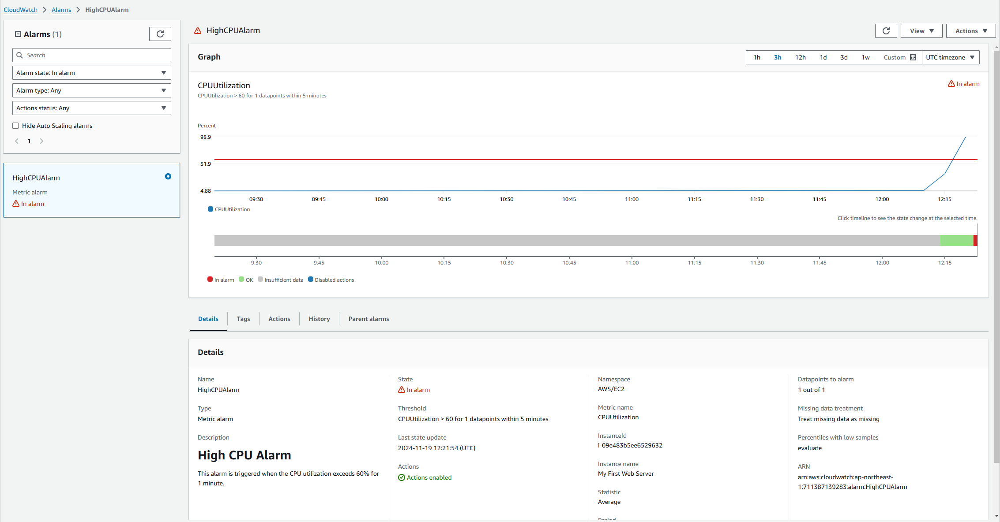
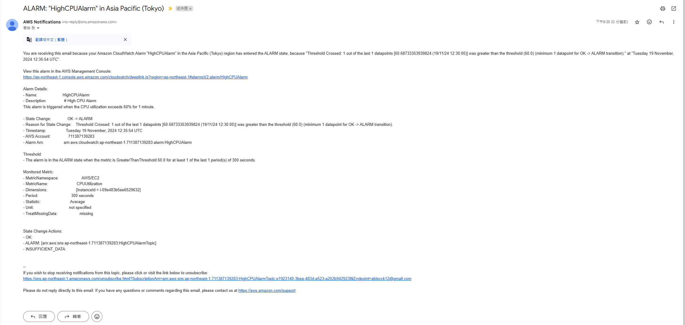
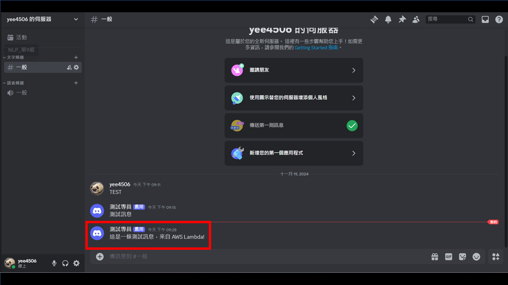
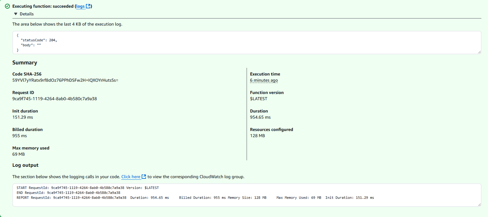

# 作業列表

- 基礎題

  - [x] metrics.png
  - [x] alarm-graph.png
  - [x] alarm-email.png

- 進階題

  - [x] Lambda function 程式 (使用 Node.js)
  - [x] lambda-discord.png
  - [x] lambda-logs.png

## 筆記

##### 基礎題

CPUUtilization 的截圖

因為我的 firstWebServer 一直都開著，所以可以看到相對多的訊息。
也能夠清楚看到 CPU 使用量不太高

---

AWS CloudWatch Alarm 圖表的截圖

在經過`stress-ng`工具後，就可以觀察到 CPU 用量爆衝。

---

收到通知的截圖

並且因為在設定 alarm 時，設定了 Email。所以同步會將問題資訊傳到 Email。

##### 進階題

Lambda function 程式

```javascript
const https = require("https");

exports.handler = async (event) => {
  const webhookUrl = "DISCORD_WEBHOOK_URL";

  const message = JSON.stringify({
    content: "這是一條測試訊息，來自 AWS Lambda!",
  });

  const options = {
    hostname: "discord.com",
    path: "WEBHOOK_PATH",
    method: "POST",
    headers: {
      "Content-Type": "application/json",
      "Content-Length": Buffer.byteLength(message),
    },
  };

  try {
    const result = await new Promise((resolve, reject) => {
      const req = https.request(options, (res) => {
        let responseBody = "";

        res.on("data", (chunk) => {
          responseBody += chunk;
        });

        res.on("end", () => {
          if (res.statusCode >= 200 && res.statusCode < 300) {
            resolve({
              statusCode: res.statusCode,
              body: responseBody,
            });
          } else {
            reject(
              new Error(`HTTP Error: ${res.statusCode} - ${responseBody}`)
            );
          }
        });
      });

      req.on("error", (error) => {
        reject(new Error(`Request Failed: ${error.message}`));
      });

      req.write(message);
      req.end();
    });

    return {
      statusCode: result.statusCode,
      body: result.body,
    };
  } catch (error) {
    console.error("Error sending message to Discord:", error);
    return {
      statusCode: 500,
      body: JSON.stringify({ error: error.message }),
    };
  }
};
```

這邊 Lambda 所提供的 Runtime Node.js 20.x 來撰寫 Lambda function

---

Discord 接收到訊息的截圖

這邊我隨便創了一個私人 server 並且建立 Webhook，然後成功的 Test。

---

AWS CloudWatch Logs 擷取 Lambda Function 執行 log 的截圖

Lambda Function 執行成功後 log 的截圖。

# 其他觀念筆記

#### 進階題目的整體流程

進階題的主要目的是整合 AWS Lambda 和 Discord Webhook，利用 AWS 提供的服務進行自動化通知傳送，並且記錄與監控執行過程。

**1. 核心架構與概念**

這個架構旨在將 AWS SNS (Simple Notification Service) 的觸發機制與 AWS Lambda 結合，並透過 Discord Webhook 傳送客製化訊息到指定的 Discord 頻道。

架構流程如下：

**CloudWatch Metrics：**
CloudWatch 監控 EC2 實例（或其他 AWS 資源）的 CPU 使用率等指標。
當 CPU 使用率超過設定的閾值（例如 60%）時，觸發 CloudWatch Alarm。

**CloudWatch Alarm + SNS：**
當 Alarm 被觸發時，CloudWatch 會透過 SNS Topic 發送通知（例如：警報內容）。
SNS Topic 是一種傳遞訊息的中間機制，可以傳送訊息給訂閱的終端（如 Email、Lambda）。

**SNS + Lambda：**
SNS 將通知觸發 AWS Lambda Function。
Lambda 內部根據接收到的通知訊息（SNS Payload）進一步處理。

**Lambda 傳送到 Discord：**
Lambda 解析 SNS 的訊息，並組裝成適合 Discord Webhook 的格式。
Lambda 發送客製化的訊息到 Discord 頻道。

#### AWS Lambda 是啥?
